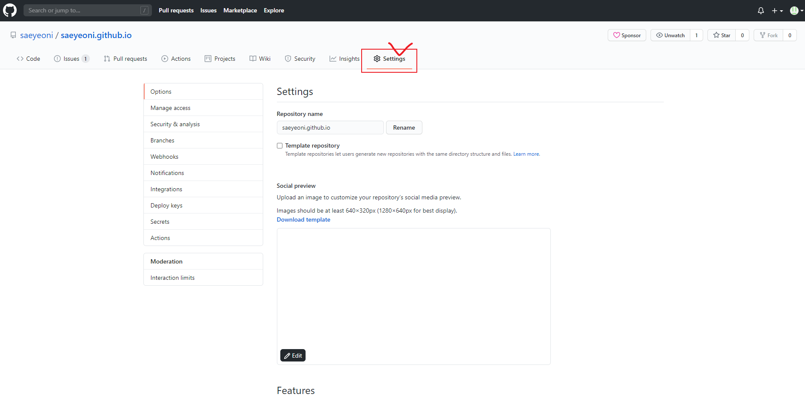
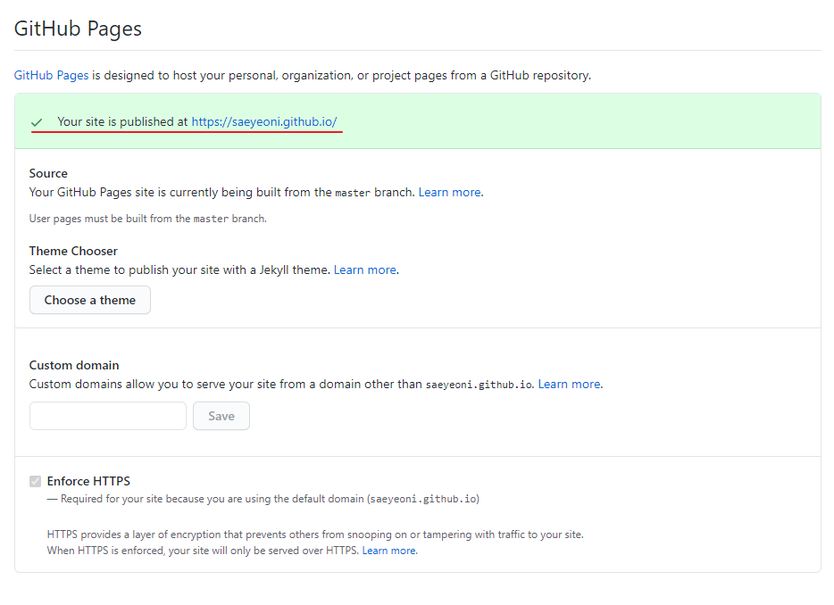

# Repository 생성
---

_이미 유저이름으로된 repository를 생성했기 때문에 빨간색으로 나타난다._

처음 git-page를 만들때 뭣도모르고 Private로 만들어 404화면만 보였다,,  
이 글을 보시는 분들은 꼭 `Public`으로 선택하시길!  
private으로도 git page를 생성할 방법은 있다. github pro를 사용하면 된다.  

# GitHub Pages 확인
---
repository 생성후 settings 메뉴로 이동한다.

쭉 내리다보면 GitHub Pages가 초록색으로 활성화 되어있고 아래 경로로 접속 할 수 있다.

아주간단하게 git블로그를 만드는 방법을 포스팅했다.  
다음으로는 GitHub Pages에 jekyll를 올려보겠다.
